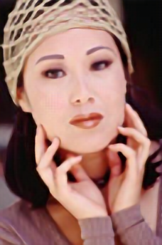
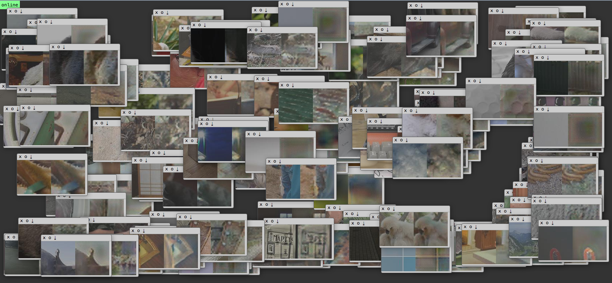

# SRGAN

This is implementation of SRGAN **under working**.

**Currently only generator part is implemented. SRResNet is implemented but not benchmarked yet.**
SRGAN is hopefully implementation soon.
I can't reproduce PSNR of bicubic in the paper, thus haven't measured the PSNR.

The paper is [Photo-Realistic Single Image Super-Resolution Using a Generative Adversarial Network](https://arxiv.org/abs/1609.04802).

These images are generated from LR images into 4x SR with trained with with the code. Check [23K results](./demo_results/)

There more experiments going on. For ex, using preactivation ResNet, 4x4 deconvolution layer to [remove artifacts](http://distill.pub/2016/deconv-checkerboard/).
	

This repository started from altering [Torch7-Network Profiler](https://github.com/e-lab/Torch7-profiling).
Used ResNet but changed a lot from original. Final using model is `models/resnet-deconv2.lua`.
The model trained uses 9x9 conv for first and last Conv layers and 15 residual blocks.

LR Patch is 3x24x24 and SR Patch is 3x96x96. It was vague in the paper that 96x96x is either LR or SR but LR96 was untrainable because of not enough memory (GTX1080).

Trained with ImageNet (50 images from 1000 classes that have 3 channel and bigger than 3x288x288).
For first time, just uncomment `prepImageNet` to have paths to images. Save it as `imgBatch.t7`
After then, comment these as original code and load it.

**Only supports, cuda/cudnn backend.**

### To profile network, 

`th profile-model.lua -m models/resnet-deconv2.lua -r 16x3x24x24 -p cuda`

### To train network,

First, parse ImageNet dataset. Manually set `datasetPath` variable as your ImageNet path. The path is expected to have 1000 sub category folders.

`th prepImageNet.lua`

Then, start train with

   `th train-SRResNet.lua -model_name 9x9-15res-LR24`
   It will save checkpoints in `model_name` directory.
   
### To resume training, 

   `th train-SRResNet.lua -model_name 9x9-15res-LR24 -checkpoint_start_from models/9x9-15res-LR24/230000.t7`

### To run/test model,

   `th run-SRResNet.lua -checkpoint_path models/9x9-15res-LR24/230000.t7 -dataset BSD100 -result_path results_23K`

   -dataset can be `BSD100|Set5|Set14.`
   
   If memory is not big enough, will print 'oom' and move on.

### Model weight
   
For those who need weight, download this weight in your 

`./checkpoints/9x9-15res-LR24` : [700K iter](https://www.dropbox.com/s/pvq5plly148brpy/700000.t7?dl=0)
`./checkpoints/VGGloss-4x4deconv` : [24K iter](: https://www.dropbox.com/s/ngru09rhfjzfos0/24000.t7?dl=0)

# Currently Doing

1. I've tried training in [preactviation resnet](https://arxiv.org/abs/1603.05027) and [removing artifacts by deconv](http://distill.pub/2016/deconv-checkerboard/). So far, analyzing what are pros and cons.

2. ContentLoss. Inlcuded `VGG/saveVGG19.sh` to build VGG loss.

- `luarocks install loadcaffe`
- Download VGG : `cd VGG; ./saveVGG19`
- `luarocks install https://raw.githubusercontent.com/szym/display/master/display-scm-0.rockspec` 
	- Install [display: a browser-based graphics server](https://github.com/szym/display)
- `th -ldisplay.start 8000 0.0.0.0`
- `th train-SRResNet-VGGloss.lua -arch models/resnet-4x4deconv-preact.lua  -model_name VGGloss-4x4deconv -checkpoint_save_iter 1000`
- localhost:8000 shows training visualization

3. PSNR

